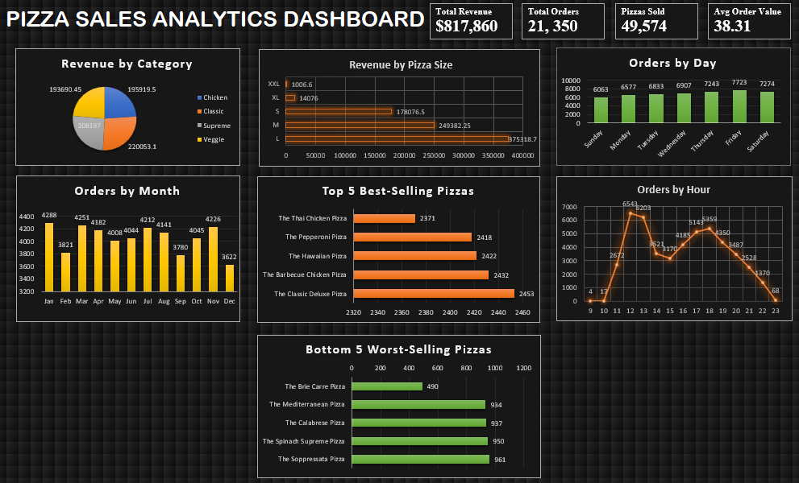

#  Pizza Sales Analytics Dashboard

##  Project Overview
This project analyzes pizza sales data using PostgreSQL and Microsoft Excel to uncover business insights related to revenue, customer ordering patterns, and product performance.
The project includes SQL-based analysis and an interactive Excel dashboard for visualization.

---

##  Tools Used
- PostgreSQL
- SQL
- Microsoft Excel
- Pivot Tables
- Charts & Data Visualization

---
## Database Setup

The dataset was imported and analyzed using PostgreSQL.

The project includes:
- setup.sql → Table creation script
- pizza_sales_analysis.sql → Business analysis queries
- pizza_sales_clean.csv → Dataset used for analysis

PostgreSQL was used to perform:
- Revenue analysis
- Trend analysis
- Product performance analysis
- Customer behavior analysis

## Key Performance Indicators (KPIs)
- Total Revenue: $817,860
- Total Orders: 21,350
- Total Pizzas Sold: 49,574
- Average Order Value: $38.31

---

## Analysis Performed
### Revenue Analysis
- Revenue by pizza category
- Revenue by pizza size

### Trend Analysis
- Orders by day
- Orders by month
- Orders by hour

### Product Performance
- Top 5 best-selling pizzas
- Bottom 5 worst-selling pizzas

### Customer Insights
- Peak ordering hours
- High-performing products

---

##  Key Insights
- Friday recorded the highest number of orders.
- Lunch and evening hours showed peak demand.
- Large-size pizzas generated the highest revenue.
- The Classic category contributed the most revenue.
- Thai Chicken Pizza generated the highest sales revenue.
- Brie Carre Pizza was the lowest-selling pizza.

---
## Project Workflow

CSV Dataset
      ↓
PostgreSQL Database
      ↓
SQL Analysis
      ↓
Excel Pivot Tables
      ↓
Interactive Dashboard

##  Dashboard Preview

---

##  Files Included
- `pizza_sales_analysis.sql`
- `setup.sql`
- `pizza_sales_clean.csv`
- `pizza_sales_dashboard.xlsx`
- `pizza_sales_dashboard.png`

---

##  Author
**Shreya Reddy S**
